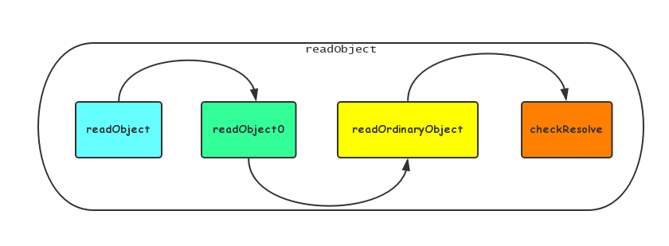

# Java序列化与单例模式
> 文章参考：https://www.cnblogs.com/ixenos/p/5831067.html

## 序列化对单例的破坏
### 1.首先来写一个单例的类：
```java
import java.io.Serializable;
public class Singleton implements Serializable{
    private volatile static Singleton singleton;
    private Singleton (){}
    public static Singleton getSingleton() {
        if (singleton == null) {
            synchronized (Singleton.class) {
                if (singleton == null) {
                    singleton = new Singleton();
                }
            }
        }
        return singleton;
    }
}
```

### 2.接下来是一个测试类：
```java
import java.io.*;
public class SerializableDemo1 {
    //为了便于理解，忽略关闭流操作及删除文件操作。真正编码时千万不要忘记
    //Exception直接抛出
    public static void main(String[] args) throws IOException, ClassNotFoundException {
        //Write Obj to file
        ObjectOutputStream oos = new ObjectOutputStream(new FileOutputStream("tempFile"));
        oos.writeObject(Singleton.getSingleton());
        //Read Obj from file
        File file = new File("tempFile");
        ObjectInputStream ois =  new ObjectInputStream(new FileInputStream(file));
        Singleton newInstance = (Singleton) ois.readObject();
        //判断是否是同一个对象
        System.out.println(newInstance == Singleton.getSingleton());
    }
}
```
> 输出结构为false，说明：通过对Singleton的序列化与反序列化得到的对象是一个新的对象，这就破坏了Singleton的单例性

### 3.为什么会这样？
对象的序列化过程通过ObjectOutputStream和ObjectInputputStream来实现的，那么带着刚刚的问题，分析一下ObjectInputputStream 的readObject 方法执行情况到底是怎样的。

为了节省篇幅，这里给出ObjectInputStream的readObject的调用栈：


这里看一下重点代码，`readOrdinaryObject`方法的代码片段
```java
public class ObjectInputStream {
    // ......省略部分代码，下面代码大约在420行
    private Object readOrdinaryObject(boolean unshared) throws IOException{
        // 第1部分
        Object obj;
        try {
            obj = desc.isInstantiable() ? desc.newInstance() : null;
        } catch (Exception ex) {
            throw (IOException) new InvalidClassException(desc.forClass().getName(), "unable to create instance").initCause(ex);
        }
    
        // 第2部分
        if (obj != null && handles.lookupException(passHandle) == null && desc.hasReadResolveMethod()) {
            Object rep = desc.invokeReadResolve(obj);
            if (unshared && rep.getClass().isArray()) {
                rep = cloneArray(rep);
            }
            if (rep != obj) {
                handles.setObject(passHandle, obj = rep);
            }
        }
        return obj;
    }
}
```

上面代码主要分两部分。先分析第1部分
```java
Object obj;
try {
    obj = desc.isInstantiable() ? desc.newInstance() : null;
} catch (Exception ex) {
    throw (IOException) new InvalidClassException(desc.forClass().getName(),"unable to create instance").initCause(ex);
}
```
这里创建的这个obj对象，就是本方法要返回的对象，也可以暂时理解为是ObjectInputStream的readObject返回的对象。

+ `isInstantiable`：如果一个serializable/externalizable的类可以在运行时被实例化，那么该方法就返回true。针对serializable和externalizable我会在其他文章中介绍。
+ `desc.newInstance`：该方法通过反射的方式调用无参构造方法新建一个对象
所以。到目前为止，也就可以解释，为什么序列化可以破坏单例了？
> 答：序列化会通过反射调用无参数的构造方法创建一个新的对象

### 4.那么，接下来我们再看刚开始留下的问题，如何防止序列化/反序列化破坏单例模式?
> 主要结合上面代码的第2部分

先给出解决方案，然后再具体分析原理：

只要在Singleton类中定义readResolve就可以解决该问题：
```java
import java.io.Serializable;
/**
 * Created by hollis on 16/2/5.
 * 使用双重校验锁方式实现单例
 */
public class Singleton implements Serializable{
    private volatile static Singleton singleton;
    private Singleton (){}
    public static Singleton getSingleton() {
        if (singleton == null) {
            synchronized (Singleton.class) {
                if (singleton == null) {
                    singleton = new Singleton();
                }
            }
        }
        return singleton;
    }
    
    // 定义了这个方法，ObjectInputStream里面readObject就会走到这里，发回序列化前创建的对象
    private Object readResolve() {
        return singleton;
    }
}
```
还是运行以下测试类：
```java
import java.io.*;
public class SerializableDemo1 {
    //为了便于理解，忽略关闭流操作及删除文件操作。真正编码时千万不要忘记
    //Exception直接抛出
    public static void main(String[] args) throws IOException, ClassNotFoundException {
        //Write Obj to file
        ObjectOutputStream oos = new ObjectOutputStream(new FileOutputStream("tempFile"));
        oos.writeObject(Singleton.getSingleton());
        //Read Obj from file
        File file = new File("tempFile");
        ObjectInputStream ois =  new ObjectInputStream(new FileInputStream(file));
        Singleton newInstance = (Singleton) ois.readObject();
        //判断是否是同一个对象
        System.out.println(newInstance == Singleton.getSingleton());
    }
}
```
本次输出结果为true。具体原理，我们回过头继续分析`3.为什么会这样？`中的第二段代码:
```java
// 第2部分
if (obj != null && handles.lookupException(passHandle) == null && desc.hasReadResolveMethod()) {
    Object rep = desc.invokeReadResolve(obj);
    if (unshared && rep.getClass().isArray()) {
        rep = cloneArray(rep);
    }
    if (rep != obj) {
        handles.setObject(passHandle, obj = rep);
    }
}
```

+ `hasReadResolveMethod`:如果实现了serializable 或者 externalizable接口的类中包含readResolve则返回true
+ `invokeReadResolve`:通过反射的方式调用要被反序列化的类的readResolve方法。

所以，原理也就清楚了，主要在Singleton中定义readResolve方法，并在该方法中指定要返回的对象的生成策略，就可以防止单例被破坏。

## 总结
> 在涉及到序列化的场景时，要格外注意他对单例的破坏。