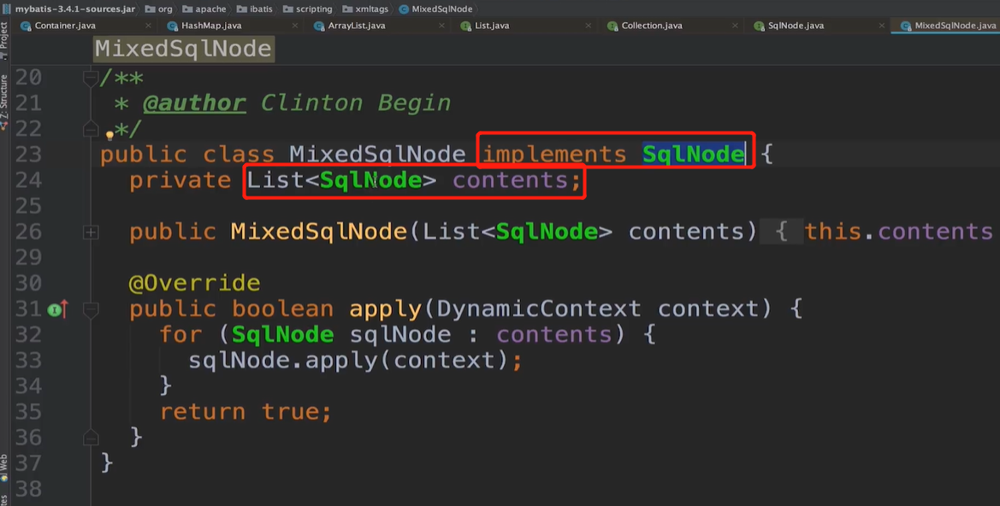

# 第14章 组合模式(composite)
> 简单说就是实现了某个接口同时包含多个此接口的组成的List

## 定义
+ 将对象组合成树形结构以表示"部分-整体"的层次结构
+ 组合模式使客户端对单个对象和组合对象保持一致的方式处理
+ 类型：结构型

## 适用场景
+ 希望客户端可以忽略组合对象和单个对象的差异时
+ 处理一个树形结构时

## 优点
+ 清楚地定义分层次的复杂对象，表示对象的全部或部分层次
+ 让客户端忽略了层次的差异，方便对整个层次结构进行控制
+ 简化客户端代码
+ 符合开闭原则

## 缺点
+ 限制类型时会较为复杂
+ 使设计变得更加抽象

## 相关设计模式
+ 组合模式和访问者模式：可以使用访问者模式访问组合模式中的递归结构

## 应用
+ JDK中
  + `java.awt.Container`
  + `java.util.HashMap`的实现`java.util.ArrayList`
+ MyBatis:`org.apache.ibatis.scrioting.xmltags.SqlNode`的实现类
  > 