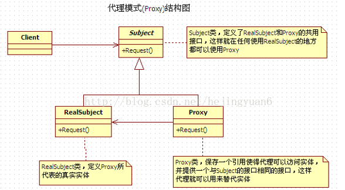

# 静态代理与动态代理
> 参考博客：https://blog.csdn.net/hejingyuan6/article/details/36203505#

> 本篇博客的由来，之前我们学习大话设计，就了解了代理模式，但为什么还要说呢？

原因：

+ 1.通过DRP这个项目，了解到了动态代理，认识到我们之前一直使用的都是静态代理，那么动态代理又有什么好处呢？它们二者的区别是什么呢？
+ 2，通过学习动态代理了解到动态代理是一种符合AOP设计思想的技术，那么什么又是AOP?

下面是我对它们的理解！

## 代理Proxy的基本概念和理解

+ Proxy代理模式是一种结构型设计模式，主要解决的问题是：在直接访问对象时带来的问题  
+ 代理是一种常用的设计模式，其目的就是为其他对象提供一个代理以控制对某个对象的访问。  
+ 代理类负责为委托类预处理消息，过滤消息并转发消息，以及进行消息被委托类执行后的后续处理。


+ 为了保持行为的一致性，代理类和委托类通常会实现相同的接口，所以在访问者看来两者没有丝毫的区别。
+ 通过代理类这中间一层，能有效控制对委托类对象的直接访问，也可以很好地隐藏和保护委托类对象，
+ 同时也为实施不同控制策略预留了空间，从而在设计上获得了更大的灵活性。

更通俗的说，代理解决的问题当两个类需要通信时，引入第三方代理类，将两个类的关系解耦，让我们只了解代理类即可，而且代理的出现还可以让我们完成与另一个类之间的关系的统一管理，但是切记，代理类和委托类要实现相同的接口，因为代理真正调用的还是委托类的方法。

使用场合举例：`如果需要委托类处理某一业务，那么我们就可以先在代理类中统一处理然后在调用具体实现类`

按照代理的创建时期，代理类可以分为两种： 
+ 静态代理：由程序员创建代理类或特定工具自动生成源代码再对其编译。在程序运行前代理类的.class文件就已经存在了。
+ 动态代理：在程序运行时运用反射机制动态创建而成。

> 下面分别用静态代理与动态代理演示一个示例：添加打印日志的功能，即每个方法调用之前和调用之后写入日志

首先声明好[用户管理接口UserManager.java](UserManager.java)

## 一、静态代理
> 代码见[静态代理](静态代理)

### 1.静态代理具体步骤
#### 1.1 实现[用户管理的具体类UserManagerImpl.java](静态代理/UserManagerImpl.java)
```java
public class UserManagerImpl implements UserManager {

    @Override
    public void addUser(String userId, String userName) {
        System.out.println("UserManagerImpl.addUser");
    }

    @Override
    public void delUser(String userId) {
        System.out.println("UserManagerImpl.delUser");
    }

    @Override
    public String findUser(String userId) {
        System.out.println("UserManagerImpl.findUser");
        return "张三";
    }

    @Override
    public void modifyUser(String userId, String userName) {
        System.out.println("UserManagerImpl.modifyUser");
    }
}
```

#### 1.2.实现[用户管理的代理类UserManagerImplProxy.java](静态代理/UserManagerImplProxy.java)
```java
public class UserManagerImplProxy implements UserManager {

    // 目标对象
    private UserManager userManager;
    // 通过构造方法传入目标对象
    public UserManagerImplProxy(UserManager userManager){
        this.userManager=userManager;
    }
    @Override
    public void addUser(String userId, String userName) {
        try{
            //添加打印日志的功能
            //开始添加用户
            System.out.println("start-->addUser()");
            userManager.addUser(userId, userName);
            //添加用户成功
            System.out.println("success-->addUser()");
        }catch(Exception e){
            //添加用户失败
            System.out.println("error-->addUser()");
        }
    }

    @Override
    public void delUser(String userId) {
        userManager.delUser(userId);
    }

    @Override
    public String findUser(String userId) {
        userManager.findUser(userId);
        return "张三";
    }

    @Override
    public void modifyUser(String userId, String userName) {
        userManager.modifyUser(userId,userName);
    }
}
```
#### 1.3 [模拟客户端测试我们的静态代理类](静态代理/Client.java)
```java
public class Client {
    public static void main(String[] args){
        // UserManager userManager=new UserManagerImpl();
        UserManager userManager=new UserManagerImplProxy(new UserManagerImpl());
        userManager.addUser("1111", "张三");
    }
}
/**
 * start-->addUser()
 * UserManagerImpl.addUser
 * success-->addUser()
 */
```

### 2.静态代理优点
> 代理使客户端不需要知道实现类是什么，怎么做的，而客户端只需知道代理即可（解耦合），对于如上的客户端代码，newUserManagerImpl()可以应用工厂将它隐藏，如上只是举个例子而已

### 3.静态代理缺点
+ 1）代理类和委托类实现了相同的接口，代理类通过委托类实现了相同的方法。这样就出现了大量的代码重复。如果接口增加一个方法，除了所有实现类需要实现这个方法外，所有代理类也需要实现此方法。增加了代码维护的复杂度。
+ 2）代理对象只服务于一种类型的对象，如果要服务多类型的对象。势必要为每一种对象都进行代理，静态代理在程序规模稍大时就无法胜任了。如上的代码是只为UserManager类的访问提供了代理，但是如果还要为其他类如Department类提供代理的话，就需要我们再次添加代理Department的代理类。
  > 举例说明：代理可以对实现类进行统一的管理，如在调用具体实现类之前，需要打印日志等信息，这样我们只需要添加一个代理类，在代理类中添加打印日志的功能，然后调用实现类，这样就避免了修改具体实现类。满足我们所说的开闭原则。但是如果想让每个实现类都添加打印日志的功能的话，就需要添加多个代理类，以及代理类中各个方法都需要添加打印日志功能（如上的代理方法中删除，修改，以及查询都需要添加上打印日志的功能）
    
总上可知，静态代理类只能为特定的接口(Service)服务。如想要为多个接口服务则需要建立很多个代理类。

为了解决上面的问题，我们引入了动态代理

## 二、动态代理
### 1.动态代理基本概念
根据如上的介绍，你会发现每个代理类只能为一个接口服务，这样程序开发中必然会产生许多的代理类  
所以我们就会想办法可以通过一个代理类完成全部的代理功能，那么我们就需要用动态代理  
在上面的示例中，一个代理只能代理一种类型，而且是在编译器就已经确定被代理的对象。而动态代理是在运行时，通过反射机制实现动态代理，并且能够代理各种类型的对象  
在Java中要想实现动态代理机制，需要`java.lang.reflect.InvocationHandler`接口和`java.lang.reflect.Proxy`类的支持

java.lang.reflect.InvocationHandler接口的定义如下
```java
//Object proxy:被代理的对象
//Method method:要调用的方法
//Object[] args:方法调用时所需要参数
public interface InvocationHandler {
    public Object invoke(Object proxy, Method method, Object[] args) throws Throwable;
}
```

java.lang.reflect.Proxy类的定义如下：
```java
//CLassLoader loader:类的加载器
//Class<?> interfaces:得到全部的接口
//InvocationHandler h:得到InvocationHandler接口的子类的实例
public static Object newProxyInstance(ClassLoader loader, Class<?>[] interfaces, InvocationHandler h) throws IllegalArgumentException
```

### 2.具体实现
#### 2.1.实现[用户管理的具体类UserManagerImpl.java](动态代理/UserManagerImpl.java)
```java
public class UserManagerImpl implements UserManager {
    @Override
    public void addUser(String userId, String userName) {
        System.out.println("UserManagerImpl.addUser");
    }

    @Override
    public void delUser(String userId) {
        System.out.println("UserManagerImpl.delUser");
    }

    @Override
    public String findUser(String userId) {
        System.out.println("UserManagerImpl.findUser");
        return "张三";
    }

    @Override
    public void modifyUser(String userId, String userName) {
        System.out.println("UserManagerImpl.modifyUser");
    }
}
```
#### 2.2 实现[动态创建代理对象的类LogHandler.java](动态代理/LogHandler.java)
```java
/**
 * 动态代理类只能代理接口（不支持抽象类），代理类都需要实现InvocationHandler类，实现invoke方法。
 * 该invoke方法就是调用被代理接口的所有方法时需要调用的，该invoke方法返回的值是被代理接口的一个实现类
 */
import java.lang.reflect.InvocationHandler;
import java.lang.reflect.Method;
import java.lang.reflect.Proxy;

public class LogHandler implements InvocationHandler {
    // 目标对象
    private Object targetObject;

    // 绑定关系，也就是关联到哪个接口（与具体的实现类绑定）的哪些方法将被调用时，执行invoke方法。
    public Object newProxyInstance(Object targetObject) {
        this.targetObject = targetObject;
        // 该方法用于为指定类装载器、一组接口及调用处理器生成动态代理类实例
        // 第一个参数指定产生代理对象的类加载器，需要将其指定为和目标对象同一个类加载器
        // 第二个参数要实现和目标对象一样的接口，所以只需要拿到目标对象的实现接口
        // 第三个参数表明这些被拦截的方法在被拦截时需要执行哪个InvocationHandler的invoke方法
        // 根据传入的目标返回一个代理对象
        return Proxy.newProxyInstance(targetObject.getClass().getClassLoader(), targetObject.getClass().getInterfaces(), this);
    }

    @Override
    //关联的这个实现类的方法被调用时将被执行
    /*InvocationHandler接口的方法，proxy表示代理，method表示原对象被调用的方法，args表示方法的参数*/
    public Object invoke(Object proxy, Method method, Object[] args) throws Throwable {
        System.out.println("start-->>");
        for (Object arg : args) {
            System.out.println(arg);
        }
        Object ret = null;
        try {
            /*原对象方法调用前处理日志信息*/
            System.out.println("satrt-->>");
            //调用目标方法
            ret = method.invoke(targetObject, args);
            /*原对象方法调用后处理日志信息*/
            System.out.println("success-->>");
        } catch (Exception e) {
            e.printStackTrace();
            System.out.println("error-->>");
            throw e;
        }
        return ret;
    }
}
```
被代理对象targetObject通过参数传递进来，我们通过targetObject.getClass().getClassLoader()获取ClassLoader对象，
然后通过targetObject.getClass().getInterfaces()获取它实现的所有接口，然后将targetObject包装到实现了
InvocationHandler接口的LogHandler对象中。通过newProxyInstance函数我们就获得了一个动态代理对象。

#### 2.3 [模拟客户端测试我们的静态代理类](动态代理/Client.java)
```java
public class Client {
    public static void main(String[] args) {
        LogHandler logHandler = new LogHandler();
        UserManager userManager = (UserManager) logHandler.newProxyInstance(new UserManagerImpl());
        // UserManager userManager=new UserManagerImpl();
        userManager.addUser("1111", "张三");
    }
    /**
     * start-->>
     * 1111
     * 张三
     * satrt-->>
     * UserManagerImpl.addUser
     * success-->>
     */
}
``` 

## 四、发散思考
### 1.AOP的功能与动态代理
AOP（AspectOrientedProgramming）：将日志记录，性能统计，安全控制，事务处理，异常处理等代码从业务逻辑代码中划分出来，通过对这些行为的分离，我们希望可以将它们独立到非指导业务逻辑的方法中，进而改变这些行为的时候不影响业务逻辑的代码---解耦。
     
针对如上的示例解释：

我们来看上面的UserManagerImplProxy类，它的两个方法`System.out.println("start-->addUser()")`和`System.out.println("success-->addUser()")`，
这是做核心动作之前和之后的两个截取段，正是这两个截取段，却是我们AOP的基础，在OOP里，System.out.println("start-->addUser()")、核心动作、System.out.println("success-->addUser()")
这个三个动作在多个类里始终在一起，但他们所要完成的逻辑却是不同的，如System.out.println("start-->addUser()")里做的可能是权限的判断，在所有类中它都是做权限判断，
而在每个类里核心动作却各不相同，System.out.println("success-->addUser()")可能做的是日志，在所有类里它都做日志。正是因为在所有的类里，
核心代码之前的操作和核心代码之后的操作都做的是同样的逻辑，因此我们需要将它们提取出来，单独分析，设计和编码，这就是我们的AOP思想。

一句话说，AOP只是在对OOP的基础上进行进一步抽象，使我们的类的职责更加单一。

### 2.动态代理优点：
动态代理与静态代理相比较，最大的好处`是接口中声明的所有方法都被转移到调用处理器一个集中的方法中处理（InvocationHandler.invoke）。
这样，在接口方法数量比较多的时候，我们可以进行灵活处理，而不需要像静态代理那样每一个方法进行中转。而且动态代理的应用使我们的类职责更加单一，复用性更强

### 3.总结
其实所谓代理，就是一个人或者一个机构代表另一个人或者另一个机构采取行动。在一些情况下，一个客户不想或者不能够直接引用一个对象，而代理对象可以在客户端和目标对象之前起到中介的作用。

代理对象就是把被代理对象包装一层，在其内部做一些额外的工作，比如用户需要上facebook,而普通网络无法直接访问，网络代理帮助用户先翻墙，然后再访问facebook。这就是代理的作用了。

纵观静态代理与动态代理，它们都能实现相同的功能，而我们看从静态代理到动态代理的这个过程，我们会发现其实动态代理只是对类做了进一步抽象和封装，使其复用性和易用性得到进一步提升而这不仅仅符合了面向对象的设计理念，其中还有AOP的身影，这也提供给我们对类抽象的一种参考。关于动态代理与AOP的关系，个人觉得AOP是一种思想，而动态代理是一种AOP思想的实现！